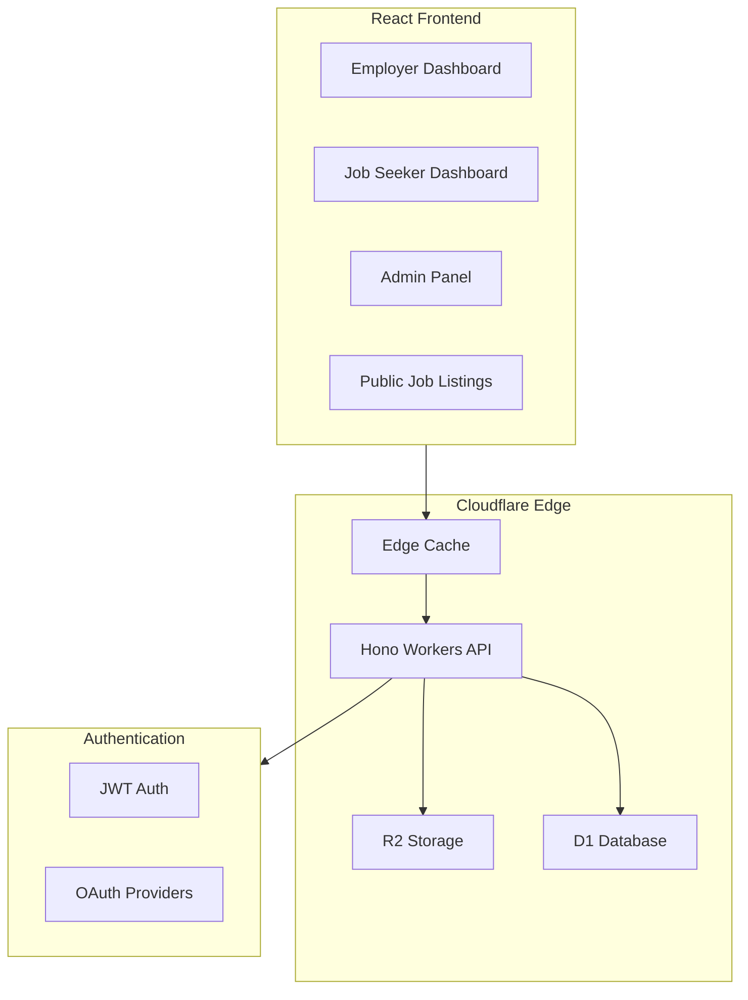
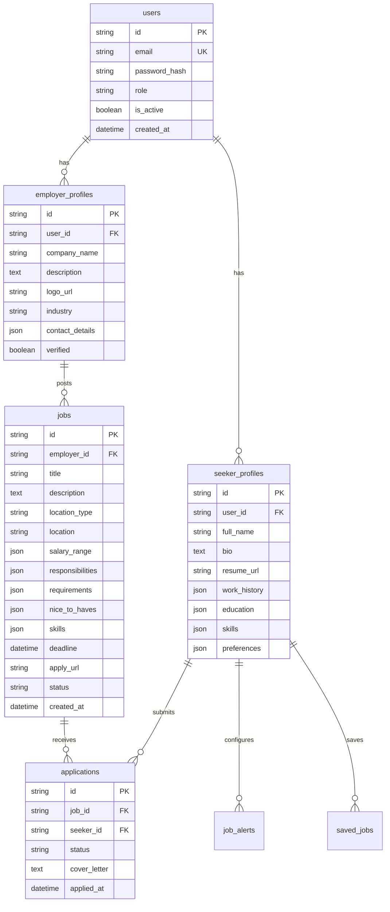
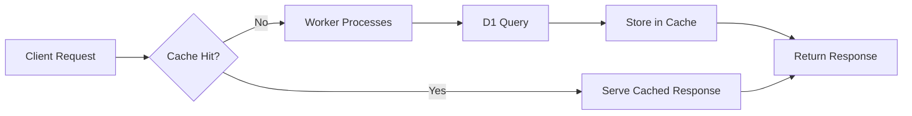

# Job Portal -

Full Stack Development Plan

## Architecture Overview




## Project Structure (Monorepo)

```javascript
JobPortal/
├── packages/
│   ├── frontend/          # React + Vite app
│   │   ├── src/
│   │   │   ├── components/
│   │   │   ├── pages/
│   │   │   ├── hooks/
│   │   │   ├── stores/
│   │   │   └── utils/
│   │   └── package.json
│   ├── api/               # Hono + Cloudflare Workers
│   │   ├── src/
│   │   │   ├── routes/
│   │   │   ├── middleware/
│   │   │   ├── services/
│   │   │   └── utils/
│   │   ├── schema/        # D1 migrations
│   │   └── wrangler.toml
│   └── shared/            # Shared types & validation
│       └── src/
├── package.json           # Workspace root
└── turbo.json             # Turborepo config
```


## Tech Stack Details

| Layer | Technology ||-------|------------|| Frontend | React 18, Vite, TailwindCSS, Zustand, React Query || Backend | Hono, Cloudflare Workers || Database | Cloudflare D1 (SQLite) || Storage | Cloudflare R2 (resumes, logos) || Auth | Custom JWT + OAuth (Google, LinkedIn) || Caching | Cloudflare Cache API, stale-while-revalidate || Validation | Zod (shared schemas) |

## Database Schema




## Implementation Details

### 1. Authentication System

- **JWT-based auth** with httpOnly cookies and refresh tokens
- **OAuth integration** hooks for Google and LinkedIn
- **Password hashing** using Web Crypto API (Cloudflare Workers compatible)
- **GDPR compliance**: Consent tracking, data export, account deletion endpoints

### 2. Edge Caching Strategy




- **Public job listings**: Cache for 5 minutes with stale-while-revalidate
- **Job details**: Cache for 1 minute
- **Static assets**: Cache for 1 year with immutable
- **User data**: No caching (always fresh)

### 3. File Upload Flow (R2)

- Generate presigned URLs from Workers for direct client uploads
- Validate file types (PDF, DOC, DOCX) and size (max 5MB)
- Store with structured keys: `resumes/{user_id}/{filename}` and `logos/{employer_id}/{filename}`

### 4. API Routes Structure

| Route Group | Endpoints ||-------------|-----------|| `/api/auth` | login, register, logout, refresh, oauth-callback, forgot-password || `/api/jobs` | CRUD operations, search with filters, bulk actions || `/api/employers` | profile, dashboard, applicants, analytics || `/api/seekers` | profile, applications, saved-jobs, alerts || `/api/admin` | users, jobs, applications, analytics, settings || `/api/upload` | presigned-url, confirm-upload |

### 5. Frontend Pages

**Public**

- Home with featured jobs and search
- Job listings with filters
- Job detail page
- Login/Register

**Job Seeker**

- Dashboard with application stats
- Profile editor with resume upload
- Application tracker
- Job alerts management
- Saved jobs

**Employer**

- Dashboard with job stats
- Job posting form (rich editor)
- Applicant tracking system
- Candidate messaging interface
- Company profile editor

**Admin**

- Overview dashboard with analytics
- User management (employers/seekers)
- Job moderation tools
- System settings
- Content moderation queue

### 6. UI/UX Design Approach

- **Design System**: Custom TailwindCSS configuration with Framer Motion animations
- **Typography**: Outfit (headings) + Source Sans 3 (body) - professional yet modern
- **Color Palette**: Deep navy primary (#0f172a), teal accent (#14b8a6), warm neutral backgrounds
- **Components**: Custom-built with accessibility (ARIA) compliance
- **Responsive**: Mobile-first with breakpoints at sm, md, lg, xl

### 7. Security Measures

- Input validation with Zod on both client and server
- CORS configuration for allowed origins
- Rate limiting on auth endpoints
- SQL injection prevention via D1 parameterized queries
- XSS prevention with proper escaping
- CSRF protection via SameSite cookies
- Data encryption at rest (D1/R2 default) and in transit (HTTPS)

## Files to Create

### Core Configuration

- [`package.json`](package.json) - Workspace root with Turborepo
- [`turbo.json`](turbo.json) - Build pipeline configuration
- [`packages/shared/src/types.ts`](packages/shared/src/types.ts) - Shared TypeScript types
- [`packages/shared/src/schemas.ts`](packages/shared/src/schemas.ts) - Zod validation schemas

### Backend (API)

- [`packages/api/wrangler.toml`](packages/api/wrangler.toml) - Cloudflare config
- [`packages/api/src/index.ts`](packages/api/src/index.ts) - Hono app entry
- [`packages/api/src/middleware/auth.ts`](packages/api/src/middleware/auth.ts) - Auth middleware
- [`packages/api/src/middleware/cache.ts`](packages/api/src/middleware/cache.ts) - Cache middleware
- [`packages/api/src/routes/*.ts`](packages/api/src/routes/) - Route handlers
- [`packages/api/schema/migrations/`](packages/api/schema/migrations/) - D1 migrations

### Frontend

- [`packages/frontend/src/App.tsx`](packages/frontend/src/App.tsx) - Root component with routing
- [`packages/frontend/src/stores/`](packages/frontend/src/stores/) - Zustand stores
- [`packages/frontend/src/pages/`](packages/frontend/src/pages/) - Page components
- [`packages/frontend/src/components/`](packages/frontend/src/components/) - Reusable components
- [`packages/frontend/tailwind.config.js`](packages/frontend/tailwind.config.js) - Custom theme